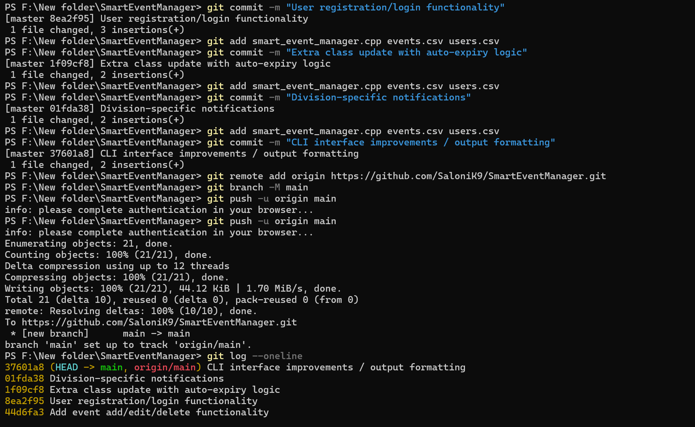
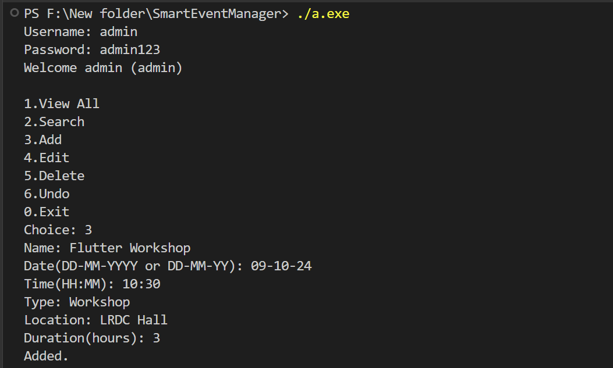
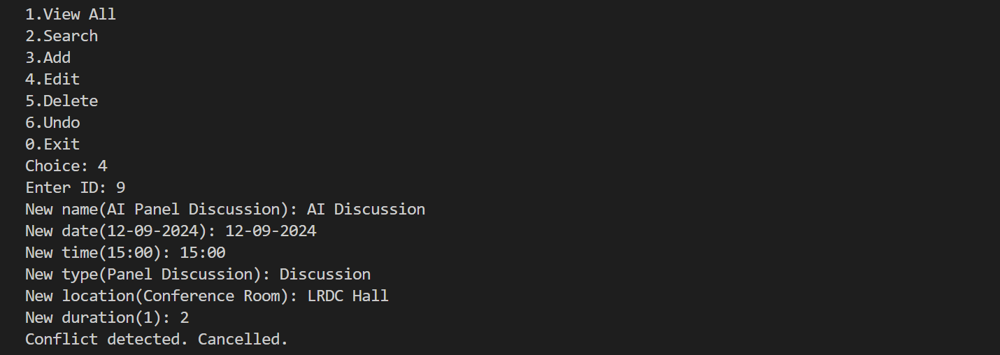
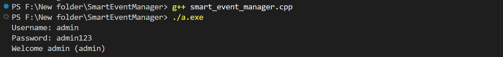
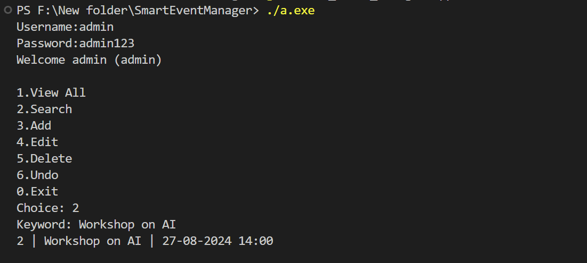

## Git Commit History

# SmartEventManager

A CLI-based smart timetable and event management system.

## Features
- Add/Edit/Delete events
- User registration/login
- Extra class update with auto-expiry
- Division-specific notifications
- CLI interface improvements

## Sample CLI Commands
- Add Event: ./a.exe add
- Edit Event: ./a.exe edit
- Delete Event: ./a.exe delete
- User Login: ./a.exe login

## How to Run
1. Compile the code:
   g++ smart_event_manager.cpp -o a.exe
2. Run the program:
   ./a.exe

## Screenshots

